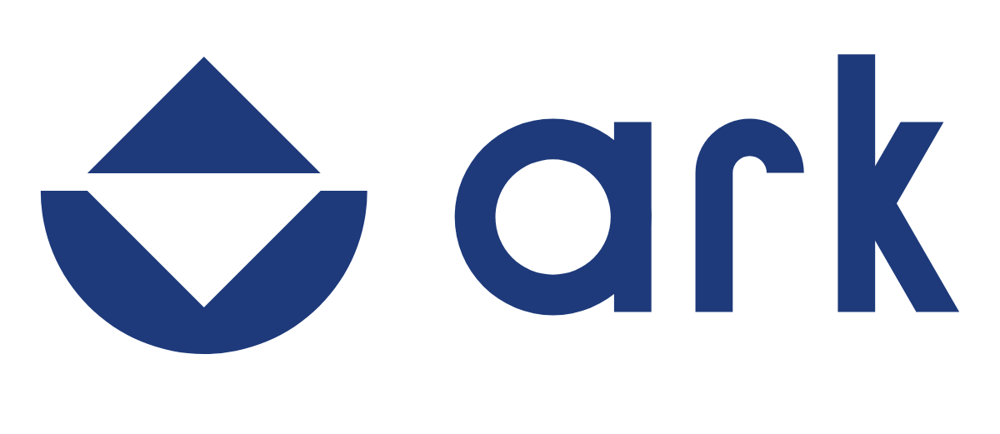
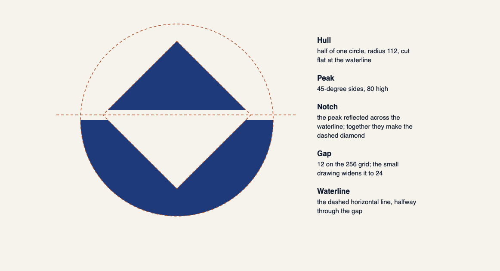
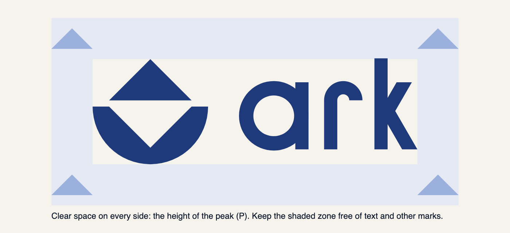
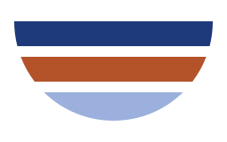

# Ark logo guidelines

How to use the Ark logo: which file to use where, spacing, sizes, colour, and what to avoid. The artwork and its design
record are in the [logo kit](README.md).

## 1. The logo

**Idea:** the peak above the waterline and its reflection held in the hull make one diamond: two halves, one whole.

| Use | File |
|---|---|
| Website header, docs, slides | `svg/ark-logo-horizontal-navy.svg` (primary) |
| Inline with text, such as a README heading | `svg/ark-logo-horizontal-flush-navy.svg` (no side padding, so it lines up with the text) |
| Square or tall spaces, social posts | `svg/ark-logo-stacked-navy.svg` |
| Symbol on its own, 32 px and up | `svg/ark-symbol-navy.svg` |
| Symbol from 16 to 31 px | `svg/ark-symbol-small-navy.svg` |
| Name only, where the symbol already appears nearby | `svg/ark-wordmark-navy.svg` |
| Any of the above on a dark background | the `-white.svg` file of the same name |
| One-colour print, stamps, engraving | the `-black.svg` file of the same name |
| App icon, wallet and token icon | `web/ark-app-icon.svg`, `web/icon-512.png` |
| Social avatar (circle-safe) | `social/ark-avatar-1024.png` |
| Favicon | `web/`: paste `web/head-snippet.html` into the page `<head>` |

The SVGs are the masters. Send printers the SVG and the CMYK values in section 5, never a PNG.

## 2. Construction

The hull is half of one circle. The peak has 45° sides, and the notch cut into the hull is the same triangle reflected
across the waterline. A 12-unit gap on the 256 grid separates them; the small drawing widens it to 24 so it stays open
at 16 px. The white files are drawn 1.2 units thinner, because light shapes on a dark ground look heavier.

## 3. Clear space

Keep a clear zone of **P** on every side, where P is the height of the peak as drawn at that size. The zone scales
with the logo; never use a fixed distance.

## 4. Minimum size

| Version | Screen | Print |
|---|---|---|
| Horizontal | 96 px wide | 25 mm wide |
| Stacked | 64 px wide | 18 mm wide |
| Symbol | 32 px | 8 mm |
| Small symbol | 16 to 31 px | 4 to 8 mm |

Nothing goes below 16 px or 4 mm.

## 5. Colour

| Name | HEX | RGB | CMYK | Pantone (nearest, proof first) | Use |
|---|---|---|---|---|---|
| Navy | `#1E3A7B` | 30 58 123 | 95 79 6 13 | 7687 C | The logo, headings, key UI |
| Ink | `#0F1A2E` | 15 26 46 | 89 75 33 62 | 5395 C | Text, dark backgrounds |
| Paper | `#F6F3EC` | 246 243 236 | 3 3 5 0 | uncoated white stock | Page backgrounds |
| Clay | `#B4532A` | 180 83 42 | 9 72 91 15 | 7592 C or 7585 C | Accents, about 10 % of a layout |
| Tide | `#9BB0DC` | 155 176 220 | 37 23 1 0 | 2717 C or 658 C | Accents on dark UI, the dark favicon |

CMYK values come from macOS ColorSync's Generic CMYK profile and are a starting point; ask the printer for a conversion
to their profile. The Pantone matches were picked by eye, so check them against a physical guide before any print run.

**Approved pairs:** navy logo on white or Paper (10.8 : 1 and 9.7 : 1) · white logo on Navy or Ink · black logo for
one-colour print. The navy logo does not go on Ink or dark photos (1.6 : 1); use the white file there. Clay and Tide are
accents only and never colour the logo. Clay on Paper passes body-text contrast (4.5 : 1), and so does white on Clay
(5.0 : 1).

## 6. The decks motif

A secondary graphic, not a logo: a hull of three decks, one per fund. Use it to explain the Redemption Buffer, the
strategic Reserve and Insurance in docs, dashboards and the whitepaper. The suggested order, top to keel, follows the
whitepaper: Buffer (Navy), Reserve (Clay), Insurance (Tide). The three still separate in greyscale. A single-colour
version is `motifs/ark-decks-navy.svg`. Never put the motif inside a lockup or use it in place of the symbol.

## 7. Typography

- The wordmark is drawn, not typed. Never recreate it by setting "ark" in a font.
- In running text the name is "Ark". The wordmark is lowercase by design.
- Suggested families, both under the SIL Open Font License: **Inter** for text and UI, **JetBrains Mono** for code and
  the command line. Web fallback: `system-ui, -apple-system, "Segoe UI", sans-serif`.

## 8. Don'ts

- Don't close the waterline gap or fill the notch; the diamond needs both halves.
- Don't colour the peak and hull differently, and don't use Clay or Tide for the logo.
- Don't rotate or flip it. Upside down it reads as a different sign.
- Don't stretch it, outline it, or add shadows, gradients or glows.
- Don't put the navy logo on a dark background; use the white file.
- Don't rearrange or resize the parts of a lockup.
- Don't use the main symbol below 32 px; switch to the small drawing.
- Don't show the retired Hull icon next to the new mark.

## 9. Master files

Every SVG is generated by `source/kit.py` (Python 3, no dependencies). To change the logo, edit the numbers there and
run `source/build.sh`; don't hand-edit the SVGs.
